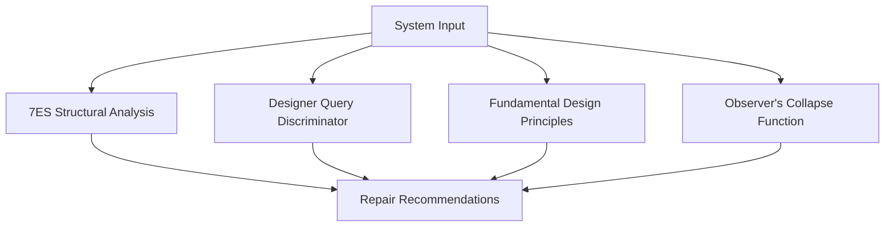

```markdown
# KOSMOS Systems Auditor

  
*"Auditing human systems through nature's design principles"*

## 🔍 Overview

The KOSMOS Systems Auditor is a biomimetic framework for analyzing and scoring complex systems (economic, political, technological, or ecological) against nature's 3.8 billion years of evolutionary wisdom. It provides:

- **Quantitative metrics** comparing human systems to natural benchmarks
- **Collapse risk forecasting** via physics-inspired models
- **Biomimetic repair protocols** for failing systems



## 🌿 Core Frameworks

### 1. 7ES Structural Anatomy
Evaluates systems across 7 elements:
```
Input | Output | Processing | Controls 
Feedback | Interface | Environment
```

### 2. Designer Query Discriminator (DQD)
Measures design origins:
```
DQD = (Designer Traceability + Goal Alignment + Enforcement Dependency)/3
```
- **0-0.3**: Emergent/Natural  
- **0.4-0.6**: Hybrid  
- **0.7-1.0**: Designed/Unnatural

### 3. Fundamental Design Principles (FDPs)
8 biomimetic metrics scored 0-10:
1. Symbiotic Purpose  
2. Adaptive Resilience  
3. Reciprocal Ethics  
4. Closed-Loop Materiality  
5. Distributed Agency  
6. Contextual Harmony  
7. Emergent Transparency  
8. Intellectual Honesty  

### 4. Observer's Collapse Function (OCF)
```
OCF = (Belief Dependence × Participation Dependency)/Stability
```
- **>0.6**: High collapse risk

## 🚀 Getting Started

### Prerequisites
- Python 3.8+
- Jupyter Notebook (for analysis)

### Installation
```bash
git clone https://github.com/yourusername/kosmos-auditor.git
cd kosmos-auditor
pip install -r requirements.txt
```

### Basic Usage
```python
from kosmos import Auditor

# Audit a system
report = Auditor.analyze(
    system="Global Capitalism",
    domain="Economy",
    scale="Macro"
)

# Generate repair protocols
repairs = Auditor.repair(
    fdp_scores=report.fdp_scores,
    ocf=report.ocf_score
)
```

## 📊 Example Audits

| System            | DQD  | FDP  | OCF  | Status          |
|-------------------|------|------|------|-----------------|
| Coral Reef        | 0.1  | 9.8  | 0.05 | Natural         |
| US Healthcare     | 0.7  | 4.2  | 0.69 | Critical        |
| Bitcoin           | 0.4  | 6.1  | 0.33 | Hybrid          |

## 📚 Documentation

- [Framework Reference](docs/reference.md)
- [Case Studies](docs/case_studies.md)
- [API Documentation](docs/api.md)

## 🌱 Contributing

We welcome contributions! Please see:
- [Contribution Guidelines](CONTRIBUTING.md)
- [Roadmap](docs/roadmap.md)

Current Priorities:
1. Expand natural systems database
2. Develop ML-assisted scoring
3. Add visualization toolkit

## 📜 License
GNU Affero General Public License v3.0

## ✉️ Contact
[Your Email] | [Twitter Handle] | [Website]
```

### Key Features:

1. **Visual Hierarchy**:
   - Clean headers with emoji icons
   - Mermaid.js flowchart for conceptual overview
   - Responsive tables for example audits

2. **Technical Documentation**:
   - Clear installation/usage instructions
   - API code examples
   - Links to detailed docs

3. **Framework Explanation**:
   - Concise descriptions of all 4 core frameworks
   - Scoring scale explanations

4. **Project Management**:
   - Contribution guidelines
   - Roadmap priorities
   - License information

5. **Brand Alignment**:
   - Matches your demo's technical/natural aesthetic
   - Consistent terminology
   - Biomimicry focus throughout
